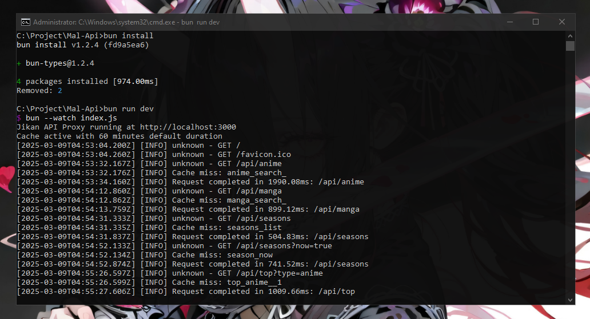

# Jikan API Proxy

A high-performance caching proxy server for the Jikan API (MyAnimeList unofficial API), built with Bun.js.

## Features

- **Advanced Caching System:** In-memory cache with disk persistence for optimal performance.
- **Rate Limiting:** Built-in rate limiting to respect Jikan API's limits (4 requests per second).
- **Performance Monitoring:** Comprehensive statistics on cache hits, response times, and endpoint usage.
- **Fault Tolerance:** Handles API errors gracefully with detailed logging.
- **Persistent Cache:** Cache data is saved to disk and loaded on restart.



## Supported Endpoints

The proxy supports all major Jikan API v4 endpoints:

- `/api/anime` - Search anime or get by ID with `?id=123`
- `/api/manga` - Search manga or get by ID with `?id=123`
- `/api/seasons` - Get anime by season
- `/api/seasons?now=true` - Get current season anime
- `/api/top` - Get top anime/manga with `?type=anime|manga`
- `/api/schedule` - Get anime schedule with `?day=day`
- `/api/genres` - Get genres with `?type=anime|manga`
- `/api/characters` - Search characters or get by ID with `?id=123`
- `/api/people` - Search people or get by ID with `?id=123`
- `/api/random` - Get random anime/manga with `?type=anime|manga`
- `/api/reviews` - Get reviews with `?type=anime|manga`
- `/api/recommendations` - Get recommendations with `?type=anime|manga`
- `/api/studios` - Get studios list or details with `?id=123`
- `/api/stats` - Get server statistics

## Installation

### Prerequisites

- [Bun.js](https://bun.sh/) (>= 1.0.0)

### Setup

1. Clone the repository:
   ```bash
   git clone https://github.com/rakarmp/jikan-api-proxy.git
   cd jikan-api-proxy
   ```

2. Install dependencies:
   ```bash
   bun install
   ```

3. Run the server:
   ```bash
   bun run index.js
   ```

The server will start on port 3000 by default, or you can specify a different port using the `PORT` environment variable.

## Configuration

The following constants can be modified in the `index.js` file:

- `PORT`: Server port (default: 3000)
- `CACHE_DURATION`: Default cache duration in milliseconds (default: 1 hour)
- `CACHE_DIR`: Directory for cache storage (default: "./cache")
- `LOGS_DIR`: Directory for log files (default: "./logs")

Different cache durations are set for specific endpoints:
- Seasonal data: 12 hours
- Current season: 6 hours
- Season list: 24 hours
- Top charts: 3 hours
- Schedule: 12 hours
- Genres: 7 days
- Character info: 7 days
- Person info: 7 days
- Reviews: 6 hours
- Recommendations: 12 hours
- Studios: 7 days

## Usage Examples

### Basic Anime Search

```
GET http://localhost:3000/api/anime?q=naruto
```

### Get Specific Anime by ID

```
GET http://localhost:3000/api/anime?id=5
```

### Get Current Season Anime

```
GET http://localhost:3000/api/seasons?now=true
```

### Get Top Anime

```
GET http://localhost:3000/api/top?type=anime
```

### Server Statistics

```
GET http://localhost:3000/api/stats
```

## Monitoring

The `/api/stats` endpoint provides detailed statistics about the server's performance:

- Uptime
- Total requests
- Cache hits and misses
- Cache hit ratio
- Error count
- Cache size
- Average response time
- Per-endpoint statistics
- Current queue length

## Maintenance

The server automatically:
- Cleans up expired cache entries every hour
- Saves the cache to disk every 30 minutes
- Saves the cache on server shutdown (handling SIGINT and SIGTERM)

## Logs

Logs are stored in the `./logs` directory, organized by date. Each log entry includes a timestamp, log level, and message.

## License

[MIT License](LICENSE)

## Acknowledgements

This project uses the [Jikan API](https://jikan.moe/) which is an unofficial MyAnimeList API.
